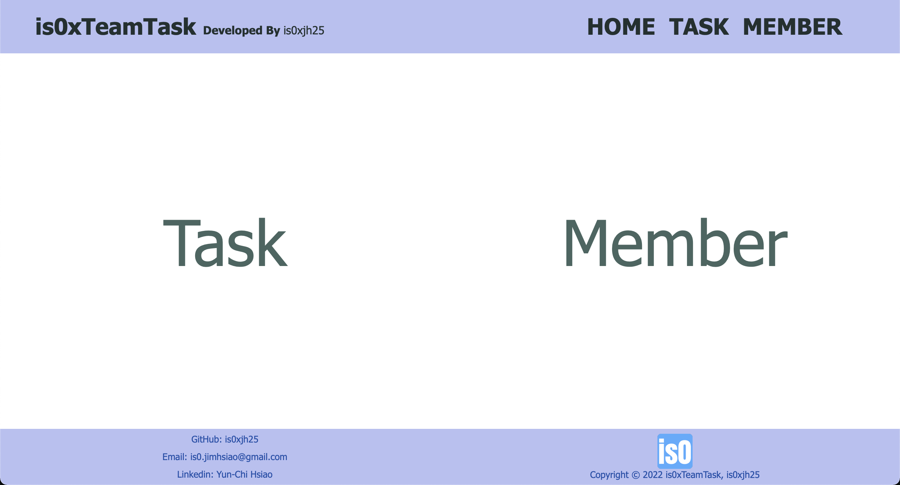
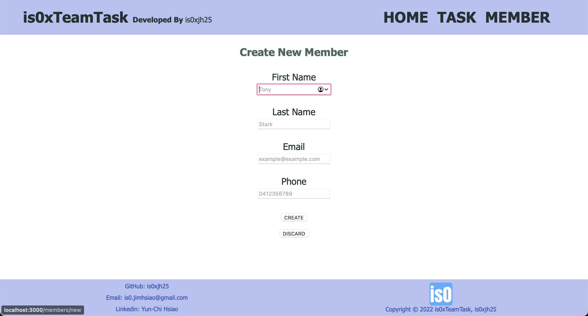
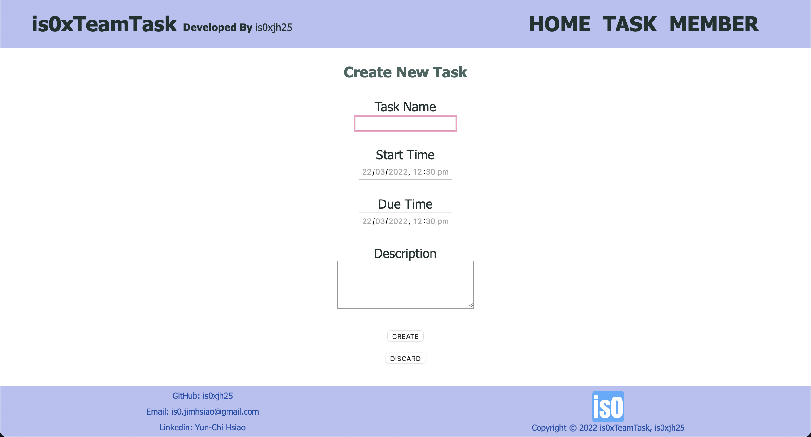
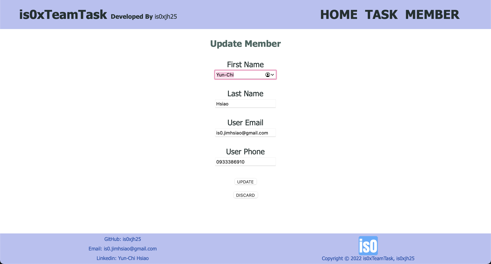
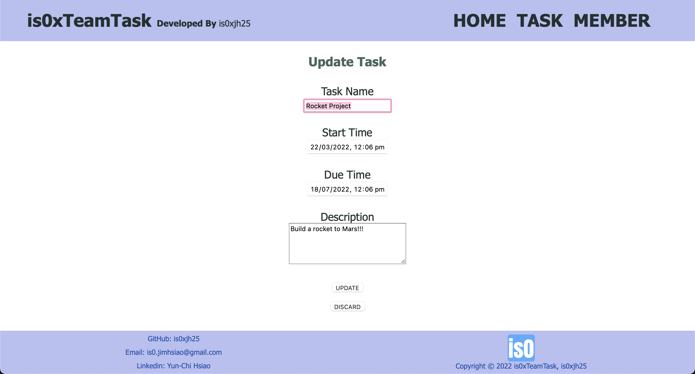
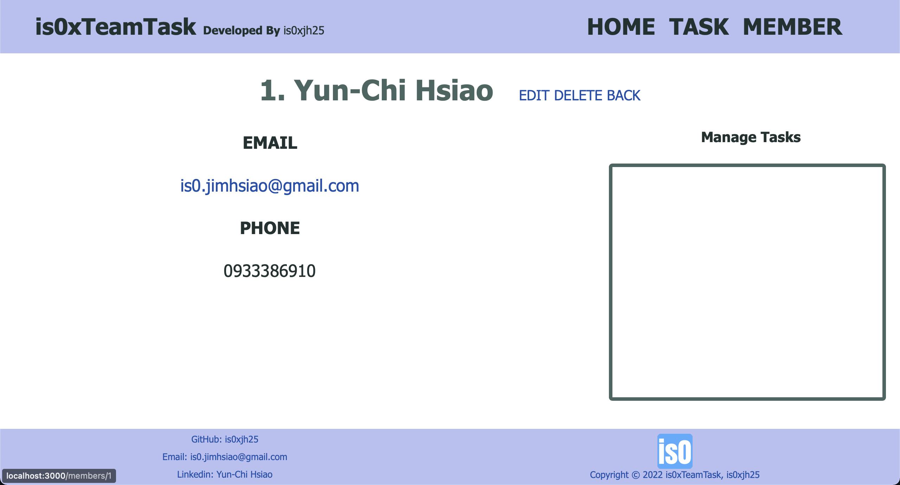
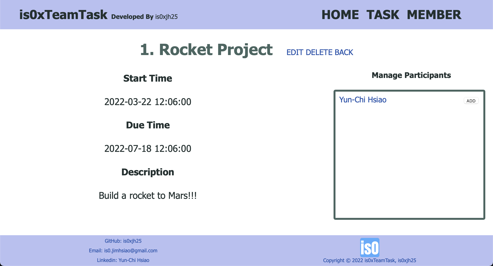

# is0xTeamTask

## Table of Content
* [About the Project](#about-the-project)
* [Getting Started](#getting-started)
* [Usage](#usage)
* [Demo](#demo)
* [Developed By](#developed-by)

## About the Project
_is0xTeamTask_ is a application for workspace support. However, it can be used in a family, class or a team which allow people to focus on thier sharing goals. The user will be play the role as manager who can manage members and tasks. The manager can allocate members into different tasks, and of course remove a member from a task. This application is user friendly, since the UI/UX is simple and clear. 

## Getting Started
- Install gems
  > Type in terminal: `bundle install`
- Initialize the local database
  > Type in terminal: `rake db:create`
- Create required tables
  > Type in terminal: `rake db:migrate`
- Execute the application
  > Type in terminal: `rails s`
- View in your browser
  > Go to `http://localhost:3000`
  
## Usage
- **Member**
  - ***Create*** a member with first name, last name, email and phone.  
              The email and phone have validations and these two fields should be unique. 
  - ***Edit*** a member. The function includes confirm and discard buttons. 
  - ***Delete*** a member. The action would also remove the member from every task he/she participates in. 
- **Task**
  - ***Create*** a member with task name, description, start date and due date.  
              The fields of description, start date and due date are not mandatory requirements. 
  - ***Edit*** a task. The function includes confirm and discard buttons. 
  - ***Delete*** a task. The action would also remove every member from the task.
- **Manage Participants**
  - ***Add Member*** into the task. 
  - ***Remove Member*** from the task.

## Demo
- **Home Page**

  

- **Create**

  
  

- **Edit**

  
  

- **Show**

  
  

## Developed By
- The application is developed by _[is0xjh25 (Yun-Chi Hsiao)](https://is0xjh25.github.io)_
 

  

